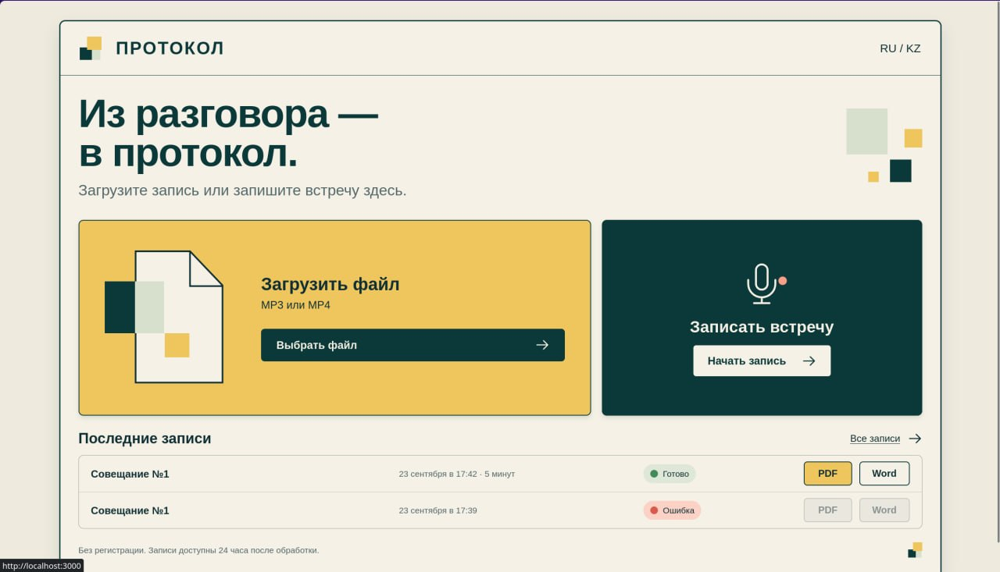
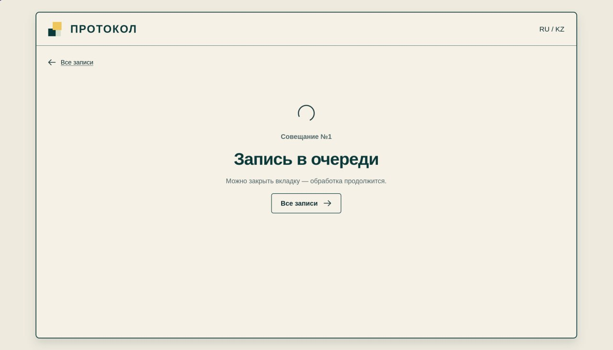
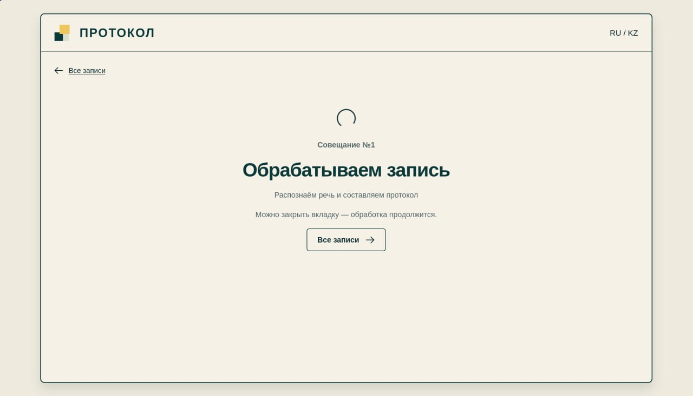
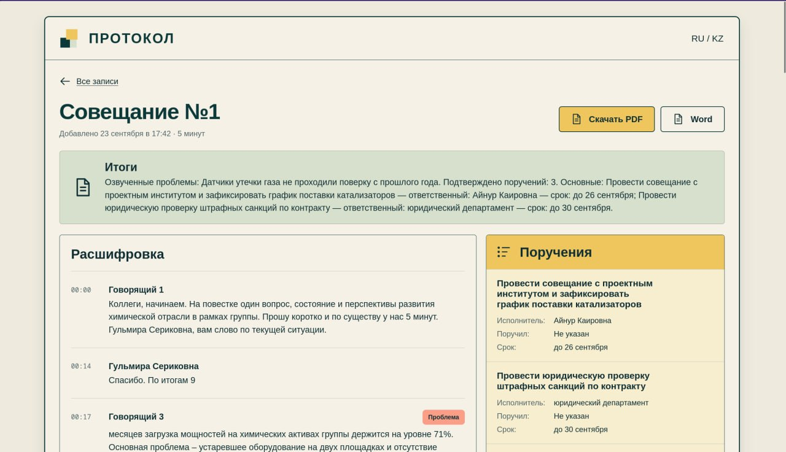
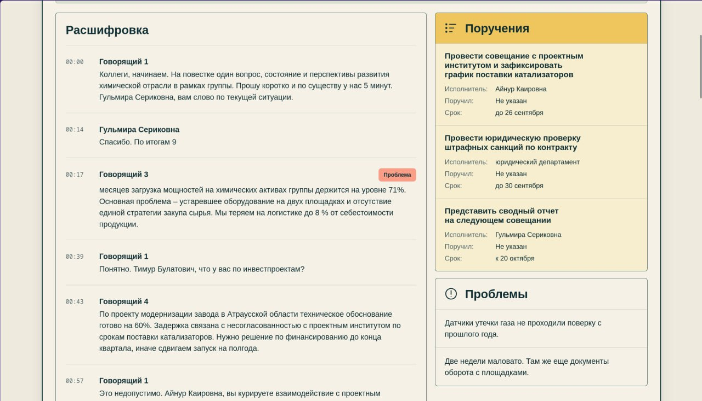

# ПРОТОКОЛ · Wamigos

Локальный сервис для протокола встречи: загружает MP3/MP4 или записывает звук в браузере, распознаёт речь, выделяет участников, поручения и проблемы, формирует PDF/DOCX. Аудио и текст не отправляются во внешние AI API.

## Основные возможности

- Загрузка готовой аудио- или видеозаписи и запись совещания непосредственно в браузере.
- Распознавание русской, казахской и смешанной речи с временными метками.
- Разделение реплик разных участников и определение имени говорящего, когда оно следует из контекста разговора.
- Автоматическое выделение поручений, исполнителей, постановщиков, сроков и обсуждавшихся проблем.
- Краткое содержание встречи и структурированная расшифровка по спикерам.
- Просмотр истории и статуса обработки записей без регистрации.
- Экспорт готового протокола в PDF и DOCX.
- Полностью локальная AI-обработка: записи, расшифровки и протоколы не передаются во внешние AI API.

## Как обрабатывается запись

```text
Аудио/видео или запись из браузера
                ↓
FFmpeg: WAV, mono, 16 кГц
                ↓
faster-whisper large-v3: текст, сегменты и временные метки
                ↓
SpeechBrain ECAPA: разделение реплик по спикерам
                ↓
Speaker Resolver: привязка найденных имён к спикерам по контексту
                ↓
Ollama + Qwen: summary, поручения, сроки и проблемы
                ↓
Spring Boot + PostgreSQL: хранение результата и управление обработкой
                ↓
Next.js: просмотр протокола и экспорт в PDF/DOCX
```

Python AI Service выполняет распознавание и анализ одной записи, а Java backend управляет загрузкой, очередью, статусами и хранением результатов. Интерфейс показывает ход обработки и готовый протокол.

## Запуск для жюри

1. Скачайте репозиторий (на GitHub: **Code → Download ZIP**) и распакуйте его. Для приватного репозитория нужен доступ к нему.
2. Установите и запустите [Docker Desktop](https://docs.docker.com/get-started/get-docker/) (Windows/macOS) либо Docker Engine с [Compose plugin](https://docs.docker.com/compose/install/linux/) (Linux). Дождитесь, пока Docker запустится.
3. Откройте терминал в распакованной папке, где лежит `compose.yaml` (на Windows подойдёт PowerShell), и выполните:

```sh
docker compose up --build --wait
```

Откройте **http://localhost:3000**. Всё остальное — Java, Python, PostgreSQL, Ollama и модели — Docker запустит сам. Отдельно устанавливать Ollama, Java, Python или создавать `.env` не нужно. Для первой сборки и загрузки публичных моделей нужен интернет и свободное место на диске (ориентир — 30 ГБ); учётные записи и API-ключи не нужны. Модели сохраняются локально. На CPU первый анализ может идти долго; для проверки возьмите короткую запись (10–20 секунд) с разборчивой речью. GPU не обязателен.

**Если есть NVIDIA GPU** и [доступ к GPU из Docker](https://docs.docker.com/compose/how-tos/gpu-support/), вместо команды выше можно запустить ускоренный режим:

```sh
docker compose -f compose.yaml -f compose.gpu.yaml up --build --wait
```

## Как проверить

Загрузите запись или запишите её микрофоном → дождитесь статуса «Готово» → проверьте расшифровку, говорящих, поручения и проблемы → скачайте PDF или Word. До конца загрузки не закрывайте вкладку. Лимит: 500 МБ и 60 минут; записи удаляются через 24 часа. Регистрация не требуется.

Если порт занят, создайте `.env` по [образцу](.env.example): для 3000 поменяйте `FRONTEND_PORT` и `FRONTEND_ORIGIN`, для 8081 — `BACKEND_PORT` и `API_PUBLIC_URL`, для 8000 — `AI_PORT`. Затем повторите запуск. Если что-то не стартовало, посмотрите `docker compose ps` и `docker compose logs --tail=100`. Остановить сервисы: `docker compose down` (данные сохраняются).

## Скриншоты

Главная: загрузка файла, запись с микрофона и последние встречи.



Запись в очереди.



Распознавание речи и подготовка протокола.



Готовый протокол: итоги встречи, расшифровка и экспорт PDF/Word.



Поручения с исполнителями и сроками, а также озвученные проблемы.



## Что внутри

Next.js → Java 21 / Spring Boot → PostgreSQL и Python / FastAPI → локальные faster-whisper, SpeechBrain ECAPA и Ollama / Qwen. Обработка идёт в контейнерах на компьютере проверяющего; готовый публичный сервер для проверки не требуется.

Подробнее: [frontend](frontend/README.md) · [backend](backend/README.md) · [AI service](ai-service/README.md) · [изменения](CHANGELOG.md).
